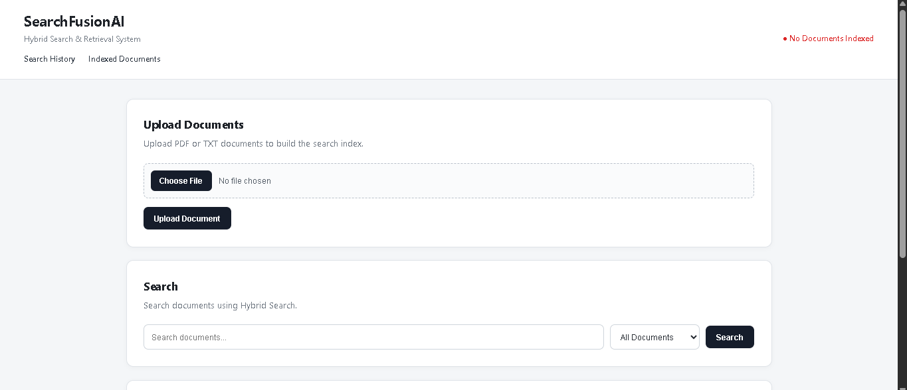
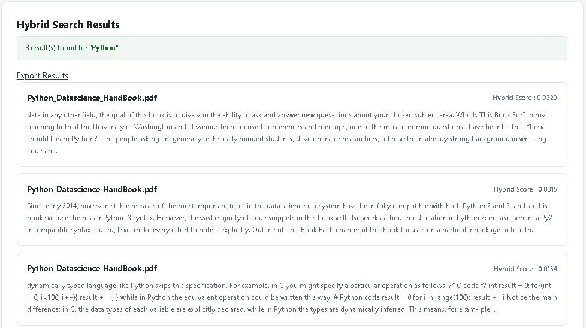
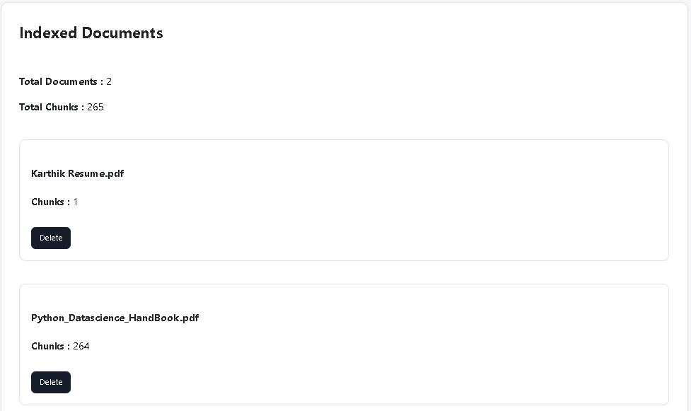
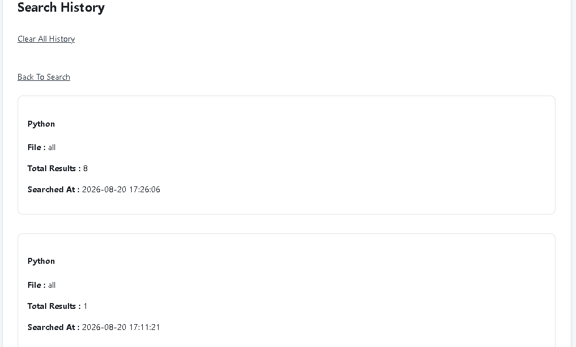

# SearchFusionAI

Hybrid Document Search and Retrieval System built with Flask.

## Features

- Upload PDF and TXT documents
- Extract document text
- Split documents into chunks
- BM25 keyword search
- FAISS semantic search
- Reciprocal Rank Fusion (RRF)
- Multi-document indexing
- Document filtering
- Duplicate document prevention
- Search history
- Document management
- Delete indexed documents
- Export search results to CSV

## Tech Stack

- Python
- Flask
- SQLite
- BM25
- FAISS
- Sentence Transformers
- HTML
- CSS
- JavaScript

## Screenshots

### Home

The main SearchFusionAI interface for uploading documents and performing searches.




### Hybrid Search

Hybrid Search combines keyword-based BM25 retrieval with semantic search using FAISS and Reciprocal Rank Fusion (RRF).




### Indexed Documents

Displays the documents currently indexed by SearchFusionAI along with their chunk counts and document management options.




### Search History

Displays previously performed searches, including the query, selected document, result count, and search time.



## Installation

```bash
git clone <repository-url>

cd SearchFusionAI

python -m venv venv

venv\Scripts\activate

pip install -r requirements.txt

python app.py
```

## Project Structure

```text
SearchFusionAI/

├── app.py
├── extractor.py
├── chunker.py
├── bm25_engine.py
├── embedding_engine.py
├── faiss_engine.py
├── rrf_engine.py
├── db.py
├── export_results.py
├── templates/
├── static/
├── uploads/
└── README.md
```